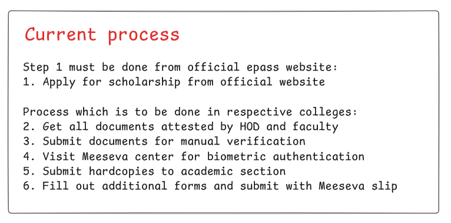
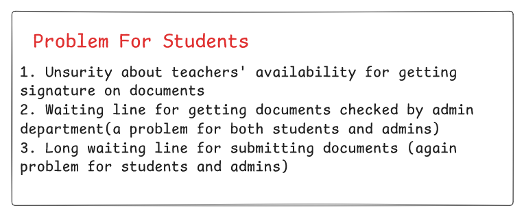

# 🎓 Scholarship Automation System
> Streamlining the scholarship process through digital automation 🚀

## 📋 Overview

The Scholarship Automation System is a web-based platform designed to simplify and digitize the traditional scholarship application process in our college. Our solution transforms the manual, time-consuming scholarship workflow into an efficient, automated system that benefits both students and administrative staff.

## Current Process




## 🎯 Problem Statement




## ✨ Features
### 📱 For Students
- Email-based registration with college email validation
- OTP verification system
- Document upload system
- Document verification using AI
- Appointment booking
- Application status tracking
- Progress monitoring
- Viewing Previous Applications

### 👨‍💼 For Administration
- Appointment management
- Application status updates
- Student data management
- Circular uploads

### For Faculty
- Mark unavailable dates
- Upload time table 


## 📊 Process Structure

```
scholarship-portal/
├── main.py                     # 🔷 Flask entry point
├── models.py                   # 🧩 SQLAlchemy database models
├── utils.py                    # ⚙️ Utility/helper functions
├── create_db.py                # 🛠️ DB initialization script
├── requirements.txt            # 📦 Python dependencies
├── Scholarship rag.pdf         # 📚 PDF used to train RAG chatbot
├── rag.py                      # 🤖 RAG-based Q&A chatbot
├── document_verification.py    # 🧠 Gemini-based document validation
├── static/                     # 🎨 Static assets (CSS, JS, uploads)
│   ├── css/
│   ├── js/
│   └── uploads/
└── templates/                  # 🖼️ HTML templates for rendering views
```


## 🛠 Technology Stack

🛠️ Tech Stack

    Backend: Python, Flask

    Frontend: HTML, CSS, JavaScript

    AI/ML: Gemini (Google), RAG (Custom-trained)

    Database: SQLite


## Installation

1. Clone the repository
```bash
git clone <repository-url>
cd scholarship-portal
```

2. Create virtual environment
```bash
python -m venv venv
.\venv\Scripts\activate
```

3. Install dependencies
```bash
pip install -r requirements.txt
```

4. Set up environment variables
```bash
# Create .env file
SECRET_KEY=your_secret_key
MAIL_SERVER=smtp.gmail.com
MAIL_PORT=587
MAIL_USERNAME=your_email
MAIL_PASSWORD=your_app_password
```

5. Initialize database
```bash
python create_db.py
```

6. Run the application
```bash
python main.py
```


## 🌟 Benefits

- ⏱ Reduced processing time
- 📝 Paperless workflow
- 🔍 Enhanced transparency
- ❌ Minimized errors
- 📊 Better tracking and monitoring
- 🔐 Secure data handling
